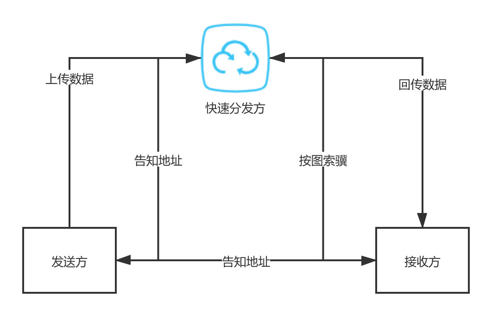

# cdn tunnel
通过一个快速的分发组织，打开一条两台主机之间快速通信的通道。
本软件服务器-客户端之间采用cintro协议沟通，cintro是一个特殊的
传输协议，它设计的目的是记录自己想要发送的数据的“地址”，通过访问该地址。
主机之间可以快速沟通，传输数据。

发送方和接收方之间传输数据使用cintro协议，关于此协议的rfc规范详见协议的实现
和存放文档的文件夹本身。

# 使用方法
使用本软件，需要至少python 3.7的环境（推荐3.8+，开发测试均在3.8上完成），
运行的时候需要在服务端运行主目录下的proxy_server.py，然后修改client文件夹中
main.py文件中的全局变量以便连接到远端，然后本地运行main.py文件，这时，
只需要正常socks5连接到本地的某个端口，就可以利用软件进行这种代理了。

软件目前没有加入配置文件、命令行参数等等功能，需要的配置均应该通过修改变量值来进行。
# 测试需求
目前，软件刚刚开发完成，必然存在一些问题，因此软件非常需要您的参与！继cdndrive
之后，把cdn图床作为一个强大的代理工具来使用！
